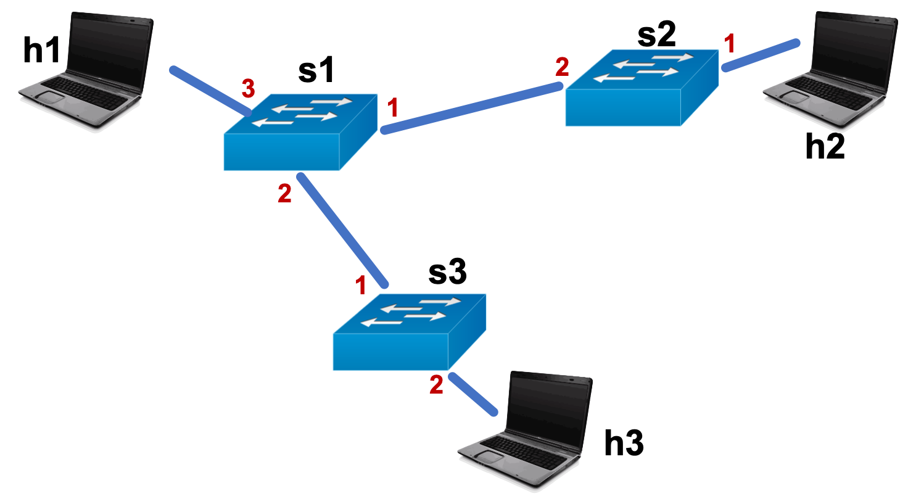

# Project 0: Getting Started

This project is to be done individually.  Please refer to Canvas for the deadline.

## Introduction

In this course, you will have an opportunity to learn about the internal workings of the Internet --- by far the largest and most influential networked system in existence.
One thing that is going to help us do this are a couple of recent innovations in networking: the *programmable switch* and *P4*, a language to program the switches.
It used to be the case that networking devices were sold as a black box and that customers were not able to understand or modify their behavior (think about most people's interaction with their home Wi-Fi router).

These days, network devices are becoming increasingly powerful and customizable.
Many home routers, for instance, now provide the ability to set static routing table entries and custom filtering rules for security and access control.
Programmable switches and P4 are at the bleeding edge of this trend, and you will get to play around with them through the first few projects of this class.
The tradeoff is that these tools are still quite new, and so part of the challenge will be picking up a brand new Domain-specific Language just from the formal specifications.
We will try to ease this process as much as possible.

>#### What you will learn
>In this project, you will get familiar with the tools we will be using throughout the beginning of the course and beyond: Vagrant, Linux, git, bitbucket, and mininet.
You will also get your first exposure to key concepts that permeate network systems design: packet processing, packet headers, match tables, and the data/control plane divide.
We will see these concepts again and again throughout the course.


## Part A: Set up the virtual machine

The first part of this assignment is to set up the virtual machine (VM) you will use for the rest of the course. This will make it easy to install all dependencies for the programming assignments, saving you the tedium of installing individual packages and ensuring your development environment is correct.
Note that this process will take a LONG time, so do not wait until the last minute to complete these steps.

>Warning: The projects are designed around the use of virtual machines.
Certain hardware like Apple's most recent M1 chip have very limited virtualization capabilities currently.
In these cases, non-VirtualBox/Vagrant solutions might be possible, or you can try building the pre-requisites in bootstrap.sh manually.

### Step 1: Install Vagrant
Vagrant is a tool for automatically configuring a VM using instructions given in a single "Vagrantfile."  You need to install Vagrant using the correct download link for your computer here: [https://www.vagrantup.com/downloads.html](https://www.vagrantup.com/downloads.html).

### Step 2: Install VirtualBox
VirtualBox is a VM provider (hypervisor).
It allows you to run an entire Ubuntu "guest OS" on top of your "host OS,"" whether that host OS is Windows, MacOS, or Linux.
You need to install VirtualBox using the correct download link for your computer here: [https://www.virtualbox.org/wiki/Downloads](https://www.virtualbox.org/wiki/Downloads). The links are under the heading "VirtualBox \<version\> platform packages."

### Step 3: Install X Server and SSH-capable terminal
You will need SSH and X Server to input commands to the virtual machine.

- For Windows, install [Xming](https://sourceforge.net/projects/xming/files/Xming/6.9.0.31/Xming-6-9-0-31-setup.exe/download) and [PuTTY](http://the.earth.li/~sgtatham/putty/latest/x86/putty.exe).
- For macOS, install [XQuartz](https://www.xquartz.org/) (Terminal is pre-installed).
- For Linux, both X server and SSH capable terminal are pre-installed.

After installing the necessary components above, restart your machine. 

### Step 4: Provision virtual machine using Vagrant
Move `Vagrantfile` and `bootstrap.sh` from the `vm_setup` directory to the parent of the 553-hw0 directory.
The final directory structure should look something like the following:

```
cis553-vagrant
+-- Vagrantfile
+-- bootstrap.sh   
+-- 553-hw0
    +-- configs
    +-- utils
    +-- vm_setup
    +-- README.md   # this document
    +-- ...
```

From your host OS in the `cis553-vagrant` directory, run the following commands to start the VM and provision it according to the Vagrantfile:

```
vagrant plugin install vagrant-disksize
vagrant up
```

**Note**: This process will take a substantial amount of time (up to multiple hours) and needs a stable Internet connection.
If the bootstrap process gets interrupted, you may need to start from scratch using `vagrant destroy; vagrant up` in the base directory.

**Troubleshooting**: If `vagrant up` is failing and you are sure you have enough disk space and a stable Internet connection, paste the output of vagrant up to Piazza.
In the worst case, you can try commenting out line 33 of the `Vagrantfile`, running `vagrant up`, and then executing all the instructions in `bootstrap.sh` from within the vagrant VM.

After the first VM setup, the following commands will allow you to stop the VM at any point (such as when you are done working on an assignment for the day):

- `vagrant suspend` will save the state of the VM and stop it.
- `vagrant halt` will gracefully shutdown the VM operating system and power down the VM.
- `vagrant destroy` will remove all traces of the VM from your system. If you have important files saved on the VM (like your assignment solutions) **DO NOT** use this command unless you have screwed up the installation in some way.

### Step 5: SSH into the VM and verify that the setup was complete

In the `cis553-vagrant` directory from your host OS, run:

```
vagrant ssh
```

This is the command you will use every time you want to access the VM.
If it works, your terminal prompt will change to `vagrant@cis553:~$`.
From here, you have access to the guest Ubuntu OS.
All further commands in this document are to be executed in this VM environment.

If all of the previous steps worked, you should be able to run the following command and see the following output:

```
cat ~/vagrant-cis553.log

# Output should match *exactly*:
Starting provisioning...
Starting mininet installation...
Starting protobuf installation...
Starting gRPC installation...
Starting BMv2 dependency installation...
Starting PI installation...
Starting BMv2 installation...
Starting P4C installation...
Starting HW3 setup...
Starting HW6 alsa setup...
Starting HW6 python...
Starting SSH setup...
All finished!!
```

**Note**: One of the nice features of Vagrant is its shared directory structure.
You don't need to copy files to and from the VM.
Any file or directory in the `cis553-vagrant` directory where the `Vagrantfile` is located is automatically shared between your computer and the virtual machine.
On the VM, these files are mapped to the `/vagrant` directory.
Run `cd /vagrant` and then `ls` to see this in action; you should be able to see the `553-hw0` directory along with the Vagrantfile and bootstrap script.

The command `logout` or `exit` will stop the SSH connection at any point.

### Step 6: Create an SSH keypair and fork the repository

In the Vagrant guest OS, run:

```
ssh-keygen -f /vagrant/cis553-key
ssh-add /vagrant/cis553-key
cat /vagrant/cis553-key.pub
```

You can leave the passphrase blank.
Normally we would not recommend this, but we will only be using this key for your class repository.

In your browser on your host OS, go to https://bitbucket.org and click on "Get Started."  Create an account using your Google@SEAS email address and verify the account once an email is sent to you.  Once you are logged into Bitbucket, go into your user setting and find the settings for "SSH keys." Click on Add key, then create label "CIS 553", and copy and paste the contents of your cis553-key.pub file into the value field.

Now to fork the repo.
Go to https://bitbucket.org/penncis553/553-hw0 and then click on the "+" in the left pane.
Choose "Fork this repository".
Keep the default name and **MAKE SURE TO CHECK THE** "This is a private repository" option.

After you successfully fork the repository, near the top of the "Overview" you should see a "Clone" button.
Click it and set the clone method to "SSH", not "HTTPS".
You should see a command starting with "git clone" that does NOT start with an https prefix, but that ends with .git.
Execute the following:

```
cd /vagrant
git clone ... # the command from the previous step
```

**Troubleshooting**: If you are seeing a `permission are too open` error, run the following commands:
```
sudo chown vagrant:vagrant /vagrant/cis553-key
chmod 600 /vagrant/cis553-key
```
If you are seeing an `ssh_exchange_identification: read: Connection reset by peer` during the `git clone` step and are on AirPennNet Wi-Fi, this is an odd firewall issue.
You can either retry the `git clone` from a different Wi-Fi, or do the clone from the *host* OS.
You should be able to access the cloned repo from within Vagrant afterwards.


## Part B: Network emulation using Mininet

This assignment runs on top of a framework called Mininet that allows us to emulate a network of hosts and network devices, all on a single machine.
Through the magic of mininet, you can treat the hosts as independent Linux machines and the network devices as independent programmable switches.
In some sense, you are running a set of networked 'virtual' machines on top of your Vagrant Virtual Machine, which is itself is running on top of your host OS.
Mininet hosts are not quite true VMs, but that's beyond the scope of this course.


We have already provided mininet setup scripts and a network topology, so you shouldn't need to modify any of the configurations, but you will need to understand how to use mininet.
You can run the provided code as follows.

### Step 1: Start up the emulation

In your vagrant VM, in the `553-hw0` directory, run:
```bash
make run
```
This will do a number of things:

  * Start a Mininet instance with three network devices (`s1`, `s2`, `s3`) and three hosts (`h1`, `h2`, and `h3`).
  * Program each of the three network devices (we'll discuss these components in more detail later).
    * Compile and run `data_plane.p4`, the data plane program, on each device.
    * Run `control_plane.py`, the control plane program, on a separate thread for each device.
  * Start up three `xterm` instances, one for each host.
  * Start up the Mininet command line interface in the original window where you ran `make run`.

The topology it sets up is depicted below.  Note that physical port numbers are labeled in red (this will be useful for the data and control plane programs).


Note that `make run` also starts up a ton of logging of the emulated network to make debugging easier.
Again, more on these later.

  * `build/`: contains the interface specification for the data plane.
  * `logs/`: contains logs of the switch data planes and the output of the `control_plane.py` program.
  * `pcaps/`: contains raw dumps of the Ethernet frames entering and leaving each port on each node in the network.

### Step 2: Run commands on the hosts

You should see a command prompt window for each host. Again, Mininet allows you to run normal Linux commands on the hosts.  You can either do this in the `xterm` windows, e.g.,

```bash
root@cis553:/vagrant/553-hw0# ifconfig
```

or you can run commands directly from the Mininet CLI by typing the node name followed by the command, e.g.,

```bash
mininet> h1 ifconfig
mininet> h2 ifconfig
mininet> h3 ifconfig
```

Note that you can always start up more `xterm` windows by running `xterm h1` in the Mininet CLI.
In any case, you should be able to see three different "interface configurations" for each host in the emulated network.  You can use the command `man ifconfig` (or `h1 man ifconfig` from the Mininet CLI) to find out more about that command.

**Troubleshooting**
If you do not see three `xterm` windows pop up, check that you properly installed XMing (Windows) or XQuartz (Mac).  Also check that `echo $DISPLAY` in your Vagrant VM outputs something similar to `localhost:10.0`.  If `$DISPLAY` does not print anything, try `vagrant halt; vagrant up` and/or check the output of `vagrant ssh -- -vvv -X` for error messages.


### Step 3: Send your first message

Now let's try sending a message from h1.
First, let's listen in on the other hosts, to see what they are seeing.
We have provided a helpful script to parse and stream the frames entering or leaving each port on each node.
This script uses a very powerful utility called `tcpdump` that can listen for and print out all of the traffic the computer sees at its network interface.
You can use the command `man tcpdump` to find out more about this command.

Let's configure them to follow their own incoming messages.

```
# On h2:
./tail_pcap.sh pcaps/h2_in.pcap
```

```
# On h3:
./tail_pcap.sh pcaps/h3_in.pcap
```

We have also provided a simple script to send a very simple Ethernet frame out of h1.
The argument to the script is the destination address to which the host should send.

```
# On h1:
./send_ethernet.sh 00:00:00:00:03:03
```

While the script is running, you should be able to see the "Node: h2" window updating with messages of the following form --- one for each message sent by h1.
We'll learn more about the 'ARP' protocol later in this class.

```
21:51:21.742931 00:00:00:00:01:01 > 00:00:00:00:03:03, ethertype ARP (0x0806), length 42: Request who-has 0.0.0.0 tell 10.0.1.1, length 28
```

### Step 4: Clean up

Type `exit` to leave each `xterm` and the Mininet CLI.
Then, to stop Mininet:
```bash
make stop
```
And to delete all pcaps, build files, and logs:
```bash
make clean
```
You will likely want to run `make stop` and/or `make clean` after every run to ensure that everything closes properly, especially during development when bugs in your code may leave the system in an inconsistent state.


## Part C: Programmable Switches

Try sending to a different destination address using the `./send_ethernet.sh` script.
Can you get the message to show up at h3?
The answer should be no as the switch data and control planes are currently configured to funnel all messages from h1 to h2 regardless of content.

Before we go into why this is happening, let's talk briefly about the structure of a typical network switch: a device whose primary task is to take a frame from an ingress port, decide where to send it, and send it out the associated egress port.
We'll go into more detail in class.
These devices are usually split into two logical components that run in parallel: the **data plane** and the **control plane**.
Often, these two devices even run on separate chips --- the data plane on a custom Application-Specific Integrated Circuit (ASIC) and the control plane on a general purpose CPU like an ARM or x86.

The data plane is responsible for processing every passing frame.
As such it needs to be *really* fast.
In fact, modern switching ASICs can typically process Terabits of data per second.
An equivalent C++ implementation running on Linux and a single x86 CPU would be lucky to get to 10s of Gigabits per second.
Data planes do this by restricting the types of operations you can do on every packet.

Of course, sometimes switches need to do more complex tasks than the data plane allows, e.g., recomputing the data plane configuration or monitoring the network.
For these tasks, we have the control plane.
Because these tasks are usually not on the critical path of packets, we are okay with them running less frequently and taking longer than packet processing.
Control planes usually run on general purpose CPUs.

Networks are, therefore, composed of many distinct entities running in parallel.
In our example Mininet topology, we have:

* 3 hosts
* 3 data planes
* 3 control planes

These 9 entities run asynchronously with each other, without any locks or shared state.


### Step 1: Data plane programming


Open up `data_plane.p4`, which specifies the per-packet data plane processing logic in the P4 language.
Let's try to understand why the network is only sending to h2.
There are a few sections to the code, but the most important for this course are the following.

#### Headers 
The headers define the structure of the packet as well as well as any local variables (aka metadata) we want to use during processing.
Local variables do not persist beyond the processing of the current packet and switch, but other header modifications are passed on to subsequent switches.

The equivalent C++ code for this block would be:

```C++
struct ethernet_t {
  char dstAddr[6];    // char is 8 bits; 48/8=6
}
struct headers_t {
  struct ethernet_t ethernet;
}

struct local_variables_t {}
```


#### Parser
The parser populates the header `hdr` from the incoming message.
The code currently assumes that the first 48 bits of every incoming message is the `dstAddr` of the Ethernet header, so the first thing the parser always does is `packet.extract(hdr.ethernet)`, which means "take the incoming packet and use the first sizeof(hdr.ethernet) bits to fill the hdr.ethernet struct".
In the future, we'll also take advantage of the fact that the parser can also extract encapsulated headers and demultiplex protocols (we'll talk about both concepts in class).

Here too, we can write equivalent C++ code to make the semantics easier to understand:

```C++
// packet, metadata, and standard_metadata are populated before entering
// hdr, metadata, and standard_metadata are outputs of the block
char* packet;
struct headers_t hdr;
struct local_variables_t metadata;
struct standard_metadata_t standard_metadata;

// always starts from start()
void start() {
    char* cursor = packet;
    parse_ethernet(cursor);
}
void parse_ethernet(char* cursor) {
    memcpy(&hdr.ethernet.dstAddr, cursor, sizeof(hdr.ethernet.dstAddr));
    cursor += sizeof(hdr.ethernet.dstAddr);
    // we don't do anything with cursor, but if we had another header, we'd start from it
    accept();
}
// finishes at accept(), otherwise, it automatically rejects (drops) the packet
```

#### Ingress
Finally, the ingress block actually processes the parsed `hdr`.
P4 is an interesting domain-specific language as it essentially boils down all programs into a series of Match-Action lookup tables, which turn out to be very easy to implement efficiently in hardware.
Every entry in the Match-Action table maps a set of header field values to an action function.
Said differently, when a packet comes it, we "match" it against the table entries to find the matching entry.
We then execute the action function specified by the table entry.

In C++, it's easiest to think about each of these tables as a switch-case statement.
In the current code, there is only one table: `tiForward`:

```
table tiForward {
    key = {
        hdr.ethernet.dstAddr : exact;
    }
    actions = {
        aiForward;
    }
}
```
The `key` field specifies the header fields the table can read.
`exact` specifies that the match should be exact, as opposed to ternary (you can specify that you don't care about some bits) or LPM (it will match the longest); don't worry about these match types for now.
The `actions` field specifies the action functions it's allowed to call.
An entry in this table would then look something like:

```
hdr.ethernet.dstAddr = /* 48 bits of data */ -> aiForward(/* parameters */)
```

You may notice that the above `table` block specifies what the table can match against and what it can call, but it doesn't say anything about the *entries* that are in the table.
That's where the control plane comes in!
It's the one that is responsible for adding, removing, and updating the entries in each data plane Match-Action table.
We will explore the operation of the control plane later.
For now, all you need to know is that the provided control plane configures a default case that is matched whenever no other matches are found, and maps that default case to `aiForward(1)`

Let's look at the equivalent C++ code:

```C++
switch(hdr.ethernet.dstAddr) {
    // case ??: aiForward(??); break;
    default: aiForward(1);
}
```

The control plane can add and remove case statements in the switch dynamically.
The ingress block as a whole is then equivalent to:

```C++
// all populated before entering
struct headers_t hdr;
struct local_variables_t metadata;
struct standard_metadata_t standard_metadata;

// always starts at apply()
void apply() {
    // apply tiForward table
    switch(hdr.ethernet.dstAddr) {
        default: aiForward(1);
    }
}

// Note: egress_port length is routed up from 9 bits
void aiForward(char egress_port[2]) {
    standard_metadata.egress_spec = 1;
}
```

One thing that is unfamiliar here is the `standard_metadata.egress_spec = 1;` line.
Basically, `standard_metadata` contains special fields that tell the switch what to do with the packet.
In this struct, `egress_spec` specifies the physical port on which we want to send the packet when we're done.
If every switch in the network is running this data plane program, can you now see why all packets from h1 end up at h2?
Make sure you understand this before moving on.

>#### Exercise
>Try to answer, just from this document, what happens to packets sent from h3?
What about packets sent from h2?
Verify your hypotheses in the Mininet emulation.
>
>How would you change the data plane to ensure that all packets sent from any host (h1, h2, h3) end up at h3?
Verify your hypothesis in Mininet.


#### More details

You can find many more details of P4 and the code using the following 

  * [P4 Specification](https://p4.org/p4-spec/docs/P4-16-v1.1.0-draft.html)
  * [V1Switch code](https://github.com/p4lang/p4c/blob/4646f1603499ebd2d42c6bf51274c18aa48943d3/p4include/v1model.p4)

The P4 specification describes the language and all of its features.
You may want to refer back to this during your subsequent projects.
The V1Switch is a P4 framework that we use in our code;
among other things, it includes a list of all members of standard_metadata.
When reading the P4 spec, if you have never seen BNF grammars before, it might be helpful to run through a quick tutorial: [BNF Tutorial](http://www.garshol.priv.no/download/text/bnf.html).

**Troubleshooting**
If you have syntax errors and other compile-time issues with your P4 code, `make run` will fail and print out an error.
If you ever have logical errors in your P4 programs, check `logs/s{1,2,3}.log`.
These files will contain a detailed trace of every operation the data plane executes.


### Step 2: Control plane programming


Okay, now let's look at the control plane that configures the above data plane.
Open up `control_plane.py`.
This Python program starts up three separate threads representing the control planes of the three switches.
The code run by each control plane is contained within the `RunControlPlane` function:

```Python
RunControlPlane(sw, id_num, p4info_helper)
"""
sw :            an object that helps us interact with the switch.  The object
                exposes functions like `WriteTableEntry`.  See `switch.py`.
id_num :        the identifier of the switch.  s1's id_num is 1, s2's id_num
                is 2, and s3's id_num is 3.  You can use this to specialize
                control plane behavior for each switch.
p4info_helper : a helper object that loads the data plane configuration and uses
                it to generate protobuf entries compatible with `sw`.  See
                `helper.py`.
"""
```

Recall from the previous section that the provided control planes of each switch all do the same thing: they configure a default case of `tiForward` that maps to the action `aiForward(1)`.
Here, we can see how the control plane accomplishes that.
It first uses `p4info_helper` to construct a `TableEntry` object that we can later write to the data plane.
In the provided code, we provide to the `buildTableEntry` function the name of the table, the name of the action, and any parameters to the action.
We also specify that this is the default action, so we don't need to provide any match specification.
There are a few resources that specify the format of this function call.

* `utils/helper.py` contains the definition of the `buildTableEntry` function as well as helper functions for constructing multicast entries and digests (useful for later projects).
For this project, we only need to look at the `buildTableEntry` function and the functions it depends on.
* `build/data_plane.p4info` contains the interface information for your P4 program.
Right now, it contains a single table definition for "cis553Ingress.tiForward" that matches against a single match field "hdr.ethernet.dstAddr", and references two actions.
One of these actions is the one that's in `data_plane.p4`: "cis553Ingress.aiForward", which has a single parameter "egress_port".
The other action is a no-op action called "NoAction" that acts as the default action before we add our own.

After we've built the table entry, we use `UpdateTableEntry` to actually update the table in the data plane.
After that function executes, the default entry on this particular switch will trigger `aiForward(1)`.
Note that we *Update* here rather than *Insert* as all tables start off with "NoAction" as the default action.
You can refer to `utils/switch.py` to find other useful functions for interacting with each switch's data plane.
The provided control planes set up the default entry when they start up, then do nothing by sitting in an empty loop forever.

As a more complex example, let's look at how we might add non-default entries to the table.
Let's say we wanted to achieve the following behavior for `tiForward`:

```C++
switch(hdr.ethernet.dstAddr) {
    // 48 bits is 12 hex characters
    case 0x123456789012: aiForward(2); break;
    case 0xffffffffffff: aiForward(2); break;
    default: aiForward(1);
}
```

We would add the following Python code to `control_plane.py`:

```Python
table_entry = p4info_helper.buildTableEntry(
        table_name = "cis553Ingress.tiForward",
        match_fields = {"hdr.ethernet.dstAddr": 0x123456789012},
        action_name = "cis553Ingress.aiForward",
        action_params = {"egress_port": 2})
sw.WriteTableEntry(table_entry)
table_entry = p4info_helper.buildTableEntry(
        table_name = "cis553Ingress.tiForward",
        match_fields = {"hdr.ethernet.dstAddr": 0xffffffffffff},
        action_name = "cis553Ingress.aiForward",
        action_params = {"egress_port": 2})
sw.WriteTableEntry(table_entry)
```

We'll go into a bit more detail about advanced use cases in class.
Note that the helper is smart enough to try to convert strings to numbers, so instead of `0xffffffffffff`, you can use MAC address notation: `"ff:ff:ff:ff:ff:ff"`.

>#### Exercise
> Let's try to create a single configuration of the network such that:   
>   - All messages with hdr.ethernet.dstAddr == "00:00:00:00:01:01" go to h1   
>   - All messages with hdr.ethernet.dstAddr == "00:00:00:00:02:02" go to h2   
>   - All messages with hdr.ethernet.dstAddr == "00:00:00:00:03:03" go to h3   
> These should be true no matter at which host the packet originate.
>
> In `pseudocode.txt`, write down, for each switch in the network, the desired behavior in C++ pseudo-code, including headers, parser, and ingress block.
> Update `data_plane.p4` and `control_plane.py` to match your pseudocode.
> Verify your code in Mininet using the `tail_pcap.sh` and `send_ethernet.sh` scripts.


#### More details

`helper.py`, `switch.py`, and `data_plane.p4info` should provide most of the information you need.  
If you want to learn more about the details or if you want more information about the expected formats, the following resources may be helpful.

* [P4Runtime Spec](https://p4.org/p4runtime/spec/master/P4Runtime-Spec.html) provides the complete specification of the control plane to data plane interface.
* [P4Runtime protobuf](https://github.com/p4lang/p4runtime/blob/a6f81ac53c6b56d75a9603690794196d67c5dc07/proto/p4/v1/p4runtime.proto) describes the underlying message format that is used to communicate between the control plane and data plane. [protobuf tutorial](https://developers.google.com/protocol-buffers/docs/proto#simple) provides a brief introduction to the Google-created protobuf framework.

**Troubleshooting**
Syntax and runtime errors in the control_plane will show up in the main terminal window, either right before or right after the start of the Mininet CLI.
For debugging logic and control/data plane interaction issues, again, the files in the `logs/` directory provide a great deal of information about the execution of P4 programs.
It should log all configuration requests from the control plane, for instance.


## Part D: Turn it in!

After you complete the Exercise in Part C Step 2, turn in your `data_plane.p4`, `control_plane.py`, and `pseudocode.txt` to Canvas.  Make sure to **Indicate your name and PennKey username in a comment at the top of the file.**  You don't need to turn in anything for Part C Step 1 or earlier parts.

As always, start early and feel free to ask questions on Piazza and in office hours.


